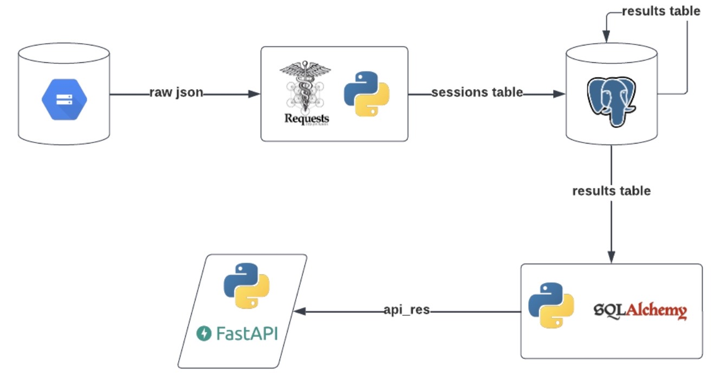
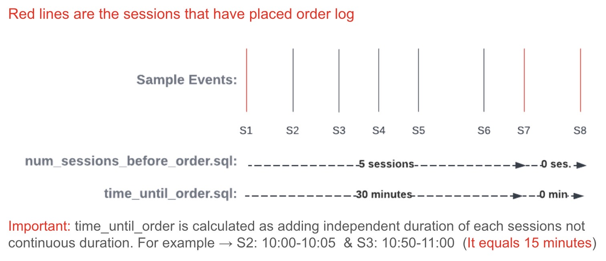

# Ingesting & Sessionizing Clickstream Data 🍪

Within that study, I will try to ingest a click or cookie data with Python and I will try to sessionize it in SQL by using PostgreSQL environment. 

## Aim of the Project 🎯

I aimed to have an exercise study to handle clickstream session data. Steps of my project is given below:

- Read data from object storage (GCS) in json with multiple arrays format by using Requests library. 
- Make sessionization in Python 
- Send data to PostgreSQL environment 
- Calculate inter/between time metrics of sessions with using SQL window functions.
- Publish results in a GET request of Python FastAPI 

The overall architecture of this project is given below:



## About the Data 💾

The data source is object storage and data os stored as json object with multiple arrays format.
The snippet of raw data is given below:

```
{"id": 463469, "type": "search", "event": {"user-agent": "Mozilla/5.0 (iPhone; CPU iPhone OS 14_2 like Mac OS X) AppleWebKit/532.0 (KHTML, like Gecko) FxiOS/14.7g5052.0 Mobile/28A193 Safari/532.0", "ip": "200.15.173.55", "customer-id": null, "timestamp": "2022-04-28T07:38:46.290271", "query": "Synchronized didactic task-force"}}
{"id": 452437, "type": "page_view", "event": {"user-agent": "Mozilla/5.0 (iPod; U; CPU iPhone OS 4_3 like Mac OS X; br-FR) AppleWebKit/533.34.2 (KHTML, like Gecko) Version/4.0.5 Mobile/8B111 Safari/6533.34.2", "ip": "121.225.65.59", "customer-id": null, "timestamp": "2022-04-28T07:17:46.290271", "page": "https://xcc-webshop.com/cart"}}
```
 
dataPrep.py file has some functions which are used to get a JSON object with multiple arrays, transform it into a pandas Dataframe object, do manipulations on data. 

 **To satisfy data quality,** validation() function is used to eliminate records having null customerId value

## Sessionization 💀

Sessionization is done in calculate_sessionid() function of dataPrep.py. Because it is an industry standard accorging to [a Google Analytics article](https://support.google.com/analytics/answer/2731565?hl=en#zippy=%2Cin-this-article), 30 minutes of time interval for unavailability between logs for a customerId is taken as session interval. 

The algoritm logic is given below:


          

## PostgreSQL Environment 🐘

**IO operations:** 

- Writing and reading operations are executed on postgreConnector.py file. 
- Before running, postgresql latest version should be downloaded to the computer (docker, website etc.)
- pg_auth() function should be updated according to the connection string of other users

**Calculating metrics on PostgreSQL:** 🧮
        
Aim is to calculate the metrics of median visit before order and median session duration minutes before order. 
These metrics are calculated on postgresql (num_session_before_order.sql and time_until_order.sql)
And the final table is created to combine the results of both metrics (results.sql)
API response will be derived from results table.

Assumptions on the calculation of metrics

num_session_before_order: 
    - If an order happens in a session, counting the previous sessions without placed_order event 
      excluding the current session. 
    - For example, if placed_order came in session 7 for a ustomer at first time
      number of sessions before order equals 6. 
    - For example, if placed_order came in session 8 but there is also an order in session 7 for a customer
      number of sessions before order equals 0. 

time_until_order
    - If an order happens in a session, adding the number of seconds spent in the previous sessions 
      without placed_order event excluding the current session. 
    - To exclude sessions with placed order in calculations, I assigned 0 second as session time in query.
    - Logic is the same with num_session_before_order.

Visual representation of these two calculations are given as:




## Publish Metrics in API Request 🔥

FastAPI is used for publishing results on API payload.

To run the API:

    - Go to the right folder which has the `app = FastAPI()` command on terminal window 
      (.>src>main>python for this case)  
    - Run the command below (if app variable is not in main.py change main:app part as filename:app)
      `$ uvicorn main:app --reload`
    - After running the command above, the terminal would be like below
        


            - On terminal, there is IP:Port information. Take this and add GET command as IP:Port/mertics/order


            - According to these results (0 and 0), whenever customers visit they give an order!

            - Besides that, Swagger UI can be used by writing IP:PORT/docs (27.0.0.1:8000/docs) to test the API


